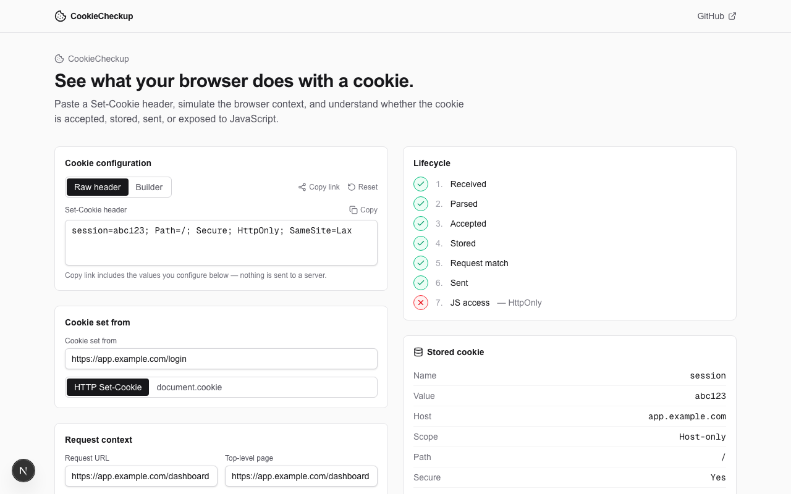

# CookieCheckup

[](https://github.com/Randy-R-code/cookie-checkup/actions/workflows/ci.yml)
[](LICENSE)

> Check, visualize, and understand how browsers handle your cookies.

**[Live demo](https://cookie-checkup.vercel.app)**

CookieCheckup is an open-source browser cookie simulator that helps developers understand whether a `Set-Cookie` configuration will be accepted, how it will be stored, when it will be sent, and whether JavaScript can access it.



## What it does

Paste a `Set-Cookie` header (or build one field by field), describe the page that sets it and a future request, and CookieCheckup walks the cookie through the same decisions a browser makes:

```text
Received → Parsed → Accepted → Stored → Request match → Sent → JavaScript access
```

Every step is explained with concrete findings — not a score, not a guess.

## Features

- **Two synchronized input modes** — a raw `Set-Cookie` header and a field-by-field builder, always in sync.
- **Acceptance simulation** — Domain scope, `Secure`, `SameSite=None` + `Secure` pairing, `Partitioned` + `Secure` pairing, and the `__Secure-` / `__Host-` / `__Http-` / `__Host-Http-` prefixes.
- **Effective storage** — the _actual_ stored cookie (host-only vs. domain scope, computed default path, resolved `SameSite`), not an echo of your input.
- **Request matching** — expiration, transport, Domain, Path, and a schemeful, registrable-domain-aware `SameSite` model decide whether a future request carries the cookie.
- **JavaScript accessibility**, evaluated separately from request eligibility — `HttpOnly` hides a cookie from `document.cookie` without ever blocking it from being sent.
- **A lifecycle diagram** showing exactly where a cookie succeeds or gets blocked.
- **Presets** for common and edge-case configurations, including intentionally invalid ones.
- **Shareable scenarios** — the full scenario is encoded in the URL hash, so it never touches a server.

## Why CookieCheckup?

A `Set-Cookie` header can look correct while being rejected by the browser, stored with a different scope than expected, omitted from a later request, unavailable to JavaScript, or affected by `SameSite`, `Secure`, `Domain`, `Path`, expiration, or cookie-prefix rules. CookieCheckup exists to make that behavior visible, without becoming a cookie consent manager, a live website scanner, or an HTTP client — see [Accuracy and browser differences](#accuracy-and-browser-differences) for what it is not.

## Getting started

```bash
git clone https://github.com/Randy-R-code/cookie-checkup.git
cd cookie-checkup
pnpm install
pnpm dev
```

Open [http://localhost:3000](http://localhost:3000). Everything runs client-side — there is no backend, no database, and no account.

## How the simulator works

The simulation engine is plain, dependency-light TypeScript with no React in it, under `src/lib/cookies/`:

```text
Raw header
   ↓ parseSetCookie
Parsed cookie
   ↓ evaluateAcceptance (domain, secure, samesite, partitioned, prefixes)
Accepted / Rejected
   ↓ buildEffectiveCookie + computeEffectiveExpiration
Stored cookie
   ↓ evaluateRequestMatch
Sent / Not sent
   ↓ evaluateJavascriptAccess
JavaScript accessible / protected
```

`simulateCookie()` in `src/lib/cookies/simulate.ts` is the single entry point and can be called entirely outside React. React only renders the `CookieSimulationResult` it returns — it never decides anything itself.

## Supported cookie behavior

- Parsing: case-insensitive attributes, duplicate-directive detection, unknown attributes preserved (never dropped, never crash-inducing).
- Domain: host-only vs. domain cookies, parent-domain validation, public-suffix rejection.
- Path: RFC-shaped default-path computation and path matching.
- Expiration: session cookies, `Max-Age` vs. `Expires` precedence, immediate-expiry cases.
- `SameSite`: `Strict` / `Lax` / `None` / unspecified (modeled as Lax-by-default, explicitly labeled as such), schemeful and registrable-domain-aware same-site detection.
- `Secure`, `HttpOnly`, `Partitioned`, and the four cookie prefixes above.

## Accuracy and browser differences

CookieCheckup uses a standards-oriented modern browser model. Browser-specific policies, the `localhost` secure-context exception, and experimental behavior (like `__Http-` / `__Host-Http-`, which are forward-looking and not yet implemented everywhere) may differ from what a specific browser actually does. Findings in the `compatibility` category call this out explicitly. CookieCheckup is not a linter for live traffic, a security scanner, or a replacement for your browser's DevTools — it is a deterministic teaching and debugging companion.

## Development

```bash
pnpm dev             # start the app
pnpm lint            # eslint
pnpm typecheck       # tsc --noEmit
pnpm test            # vitest run
pnpm test:watch      # vitest, watch mode
pnpm test:coverage   # vitest run --coverage
pnpm build           # production build
```

Before pushing meaningful simulator changes — this is also what CI runs on every push and pull request:

```bash
pnpm lint && pnpm typecheck && pnpm test && pnpm build
```

## Tests

The simulator is the product, so it is the most heavily tested part of the codebase: the parser, domain/path matching, expiration precedence, `SameSite` classification, cookie prefixes, acceptance rules, request matching, and the `simulateCookie()` orchestrator all have unit tests under `src/__tests__/`.

## Roadmap

Deliberately postponed for now (see the codebase for the full list of non-goals): multiple cookies per simulation, browser compatibility matrices, First-Party Sets, deeper CHIPS/Cookie Store API simulation, an npm package exposing the core engine, and a CLI mode. None of these are required for CookieCheckup to answer its core question well.

## Contributing

Issues and pull requests are welcome. Keep pull requests focused on a single change, and run `pnpm lint && pnpm typecheck && pnpm test && pnpm build` before opening one — the same checks run in CI on every push and pull request. Use [Conventional Commits](https://www.conventionalcommits.org/) for commit messages (`feat:`, `fix:`, `docs:`, `test:`, `chore:`, ...).

## License

MIT
